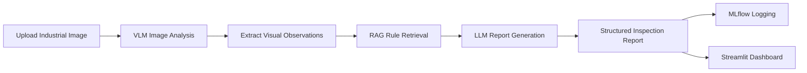
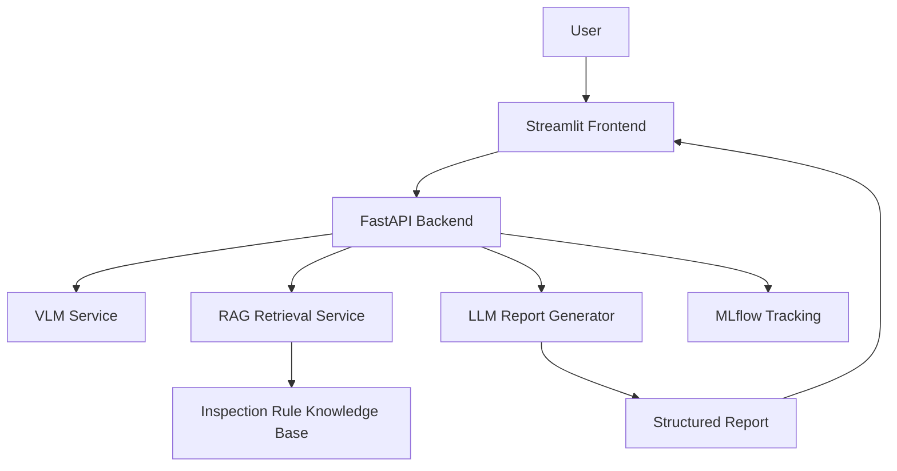

# VisionGuard AI

## Multimodal Industrial Inspection Assistant using LLM, VLM, RAG and MLOps

<p align="center">
  
  
  
  
  
  
</p>

---

## Project Overview

**VisionGuard AI** is an AI-powered industrial inspection assistant that analyzes workplace images, identifies possible safety or quality issues, retrieves relevant inspection rules, and generates a structured inspection report.

The project is designed as an **AI engineering system**, not only as a notebook experiment.

It combines:

* Vision-Language Model reasoning
* Retrieval-Augmented Generation
* Large Language Model report generation
* FastAPI backend
* Streamlit frontend
* MLflow tracking
* Docker-based deployment
* Pytest testing

---

## Problem Statement

Manual industrial inspection can be slow, inconsistent, and dependent on human attention.

This project helps automate the first inspection layer by allowing a user to upload an industrial image and receive:

* Detected safety or quality concerns
* Relevant rule-based context
* Structured inspection report
* Risk level
* Recommended actions
* Compliance checklist

---

## Core Workflow



---

## Key Features

* Upload industrial inspection images
* Analyze image content using VLM-style reasoning
* Retrieve relevant safety and quality rules using RAG
* Generate structured inspection reports using an LLM
* Log experiments and outputs using MLflow
* Provide an interactive Streamlit dashboard
* Expose backend services using FastAPI
* Include test coverage using Pytest
* Support Docker-based local deployment

---

## Use Cases

This system can support visual inspection for:

* PPE violations
* Unsafe machine proximity
* Blocked emergency exits
* Exposed cables
* Surface cracks
* Oil leakage
* Damaged industrial components
* Missing labels
* Unclear visual evidence

---

## Tech Stack

| Category    | Tools                             |
| ----------- | --------------------------------- |
| Programming | Python                            |
| Backend     | FastAPI                           |
| Frontend    | Streamlit                         |
| VLM         | Mock mode / API-based VLM support |
| LLM         | OpenAI / local LLM support        |
| RAG         | FAISS, Sentence Transformers      |
| Tracking    | MLflow                            |
| Testing     | Pytest                            |
| Deployment  | Docker, Docker Compose            |
| CI/CD       | GitHub Actions                    |

---

## System Architecture



---

## Project Structure

```text
visionguard-ai/
│
├── app/
│   ├── api/
│   ├── services/
│   ├── rag/
│   ├── vlm/
│   ├── llm/
│   └── utils/
│
├── frontend/
│   └── streamlit_app.py
│
├── knowledge_base/
│   └── inspection_rules.md
│
├── tests/
│   └── test_pipeline.py
│
├── mlruns/
│
├── docker-compose.yml
├── Dockerfile
├── requirements.txt
├── README.md
└── .gitignore
```

---

## Example Inspection Output

```text
Inspection Summary:
The image shows a worker operating near industrial equipment. Possible safety concerns include missing protective equipment and unsafe proximity to machinery.

Risk Level:
Medium to High

Relevant Rules:
- Workers should wear required PPE in operational zones.
- Emergency exits and access paths must remain clear.
- Workers should maintain safe distance from active machinery.

Recommended Actions:
1. Verify PPE compliance.
2. Check machine safety boundaries.
3. Confirm that emergency exits are not blocked.
4. Escalate for manual inspection if visual evidence is unclear.
```

---

## How to Run Locally

### 1. Clone the Repository

```bash
git clone https://github.com/Sreekar-1804/LLM-VLM.git
cd LLM-VLM
```

### 2. Create Virtual Environment

```bash
python -m venv .venv
```

### 3. Activate Environment

For Windows:

```bash
.venv\Scripts\activate
```

For macOS/Linux:

```bash
source .venv/bin/activate
```

### 4. Install Requirements

```bash
pip install -r requirements.txt
```

### 5. Run FastAPI Backend

```bash
uvicorn app.main:app --reload
```

### 6. Run Streamlit Frontend

```bash
streamlit run frontend/streamlit_app.py
```

---

## Docker Usage

```bash
docker-compose up --build
```

---

## Testing

Run tests with:

```bash
pytest
```

---

## What This Project Demonstrates

This project demonstrates:

* How to build an end-to-end AI application
* How to combine VLM, RAG, and LLM components
* How to structure an AI backend using FastAPI
* How to create a user-facing demo with Streamlit
* How to track experiments and outputs with MLflow
* How to test AI pipelines using Pytest
* How to prepare an AI system for Docker-based deployment

---

## Future Improvements

* Add stronger real VLM integration
* Add local model support using Ollama
* Improve image-level risk scoring
* Add PDF inspection report export
* Add user authentication
* Improve rule retrieval quality
* Deploy backend and frontend to cloud

---

## Recruiter Summary

This project shows practical AI engineering skills across:

```text
Image Input → VLM Analysis → RAG Retrieval → LLM Report → API → Dashboard → Tracking → Testing → Docker
```

It is designed to show applied skills in:

* Multimodal AI
* LLM applications
* Retrieval-Augmented Generation
* Computer vision workflows
* MLOps
* Backend API development
* AI product prototyping

---

## Author

**Sreekar**

<p>
  <a href="mailto:sreekar.germany.2025@gmail.com">
    
  </a>
  <a href="https://github.com/Sreekar-1804">
    
  </a>
</p>
